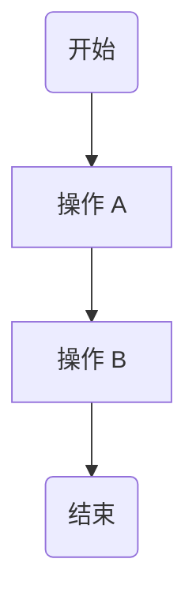
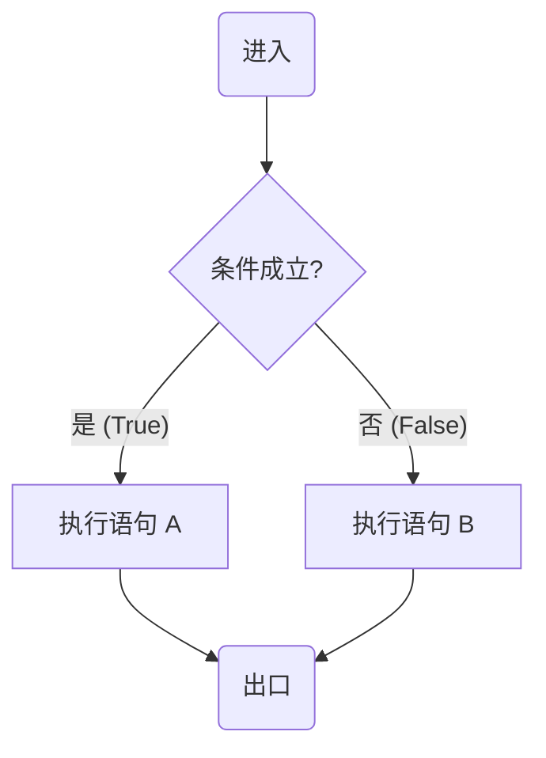
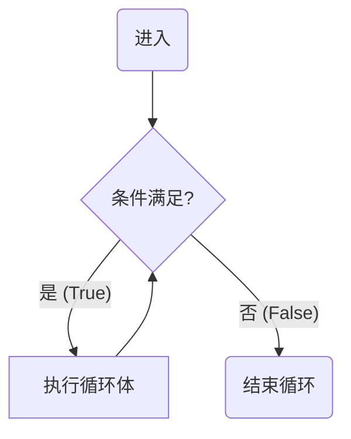
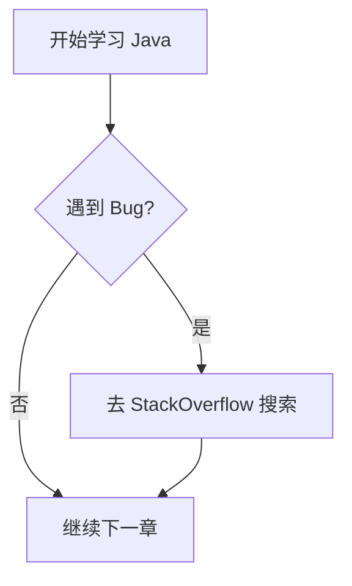

# 第1章 C语言概述

## 1. 程序和程序设计

- 程序：指令的集合
- 程序设计：用编程语言编写程序的过程

---

## 2. 程序设计语言的分类：
1. 机器语言：二进制0或1组成，计算机能直接识别
2. 汇编语言：助记符 ADD SUB 汇编程序翻译成机器语言， **与机器相关**
3. 高级语言：接近人的语言、数学符号 编译程序（解释程序）翻译成机器语言，**与机器无关**

- 面向**过程**：C Fortran
- 面向**对象**：C++ Java Python 等

### **C语言是一种高级语言，结构化（面向过程）语言** 

---

## 3. C程序编写过程

- 源文件（.c） --> （编译）--> 目标文件（.obj） --> （连接） --> 可执行文件（.exe）
- .c文件是文本文件
- **.obj文件是二进制**，但**不能执行**
- **.exe文件是二进制，可以执行**
- VC++2010: CTRL+F5 编译连接执行

---

## 4.Helloworld程序解析
1. C程序由**1个**或**多个函数**组成，**函数是C程序的基本组成单位**
2. C程序从**main函数开始**，在**main函数结束**
3. C程序**有且只有一个main函数**，main函数的位置任意
4. mian函数可以调用其他函数，mian函数不能被其他函数调用
5. C语句以分号(;)结尾，分号是C语句不可缺少的组成部分
6. **一条**C语句可以**写多行**，**一行**可以写**多条**C语句
7. **printf()**是基本**输出函数**，**不是**C提供的**输出语句**
8. **注释**：/*....*/（多行注释） //（单行注释）
    - 注释内容**不参加编译**，给人看，能更好地理解代码含义
    - **注释可以出现在**C程序中**任何适合的位置**
    - 注释**不可以嵌套**（/*...*/*....*/....*/是错误的）
9. 函数**不能嵌套定义，可以嵌套调用**（不能在一个函数中定义另一个函数）

## 5.结构化程序的三种基本结构
C 语言是结构化程序设计语言，任何复杂的算法都可以由以下三种基本结构组合而成：

1.  **顺序结构** (Sequential)
2.  **选择结构** (Selection/Branch)
3.  **循环结构** (Loop/Repetition)

### 1. 顺序结构
这是最简单的结构，程序按指令书写的先后顺序一条条执行。


### 2. 选择结构
根据条件判断的结果，选择执行不同的分支。

### 3. 循环结构 (重复)
在条件满足的情况下，反复执行某一段代码。


- 应用三种结构可以实现一切符合结构化的程序功能

### 结构化程序的**原则**
- **自顶向下**，逐步求精（逐步细化）；
- 模块化
- 限制使用goto语句

可读性好：代码很容易被人读懂和理解
清晰第一，效率第二

# 第2章 数据类型与基本操作

## 第一部分 数据类型

### 2-1 标识符
- 含义：**名称**（变量、常量、函数）

1. 标识符的**命名规则**
    1. 只能使用**字母**（**区分大小写**）、**数字（0～9）**、**下划线**（_）
    2. 只能是字母或下划线开头（**数字不能开头**）
    3. 用户自定义标识符**不能使用系统关键字**来命名

2. 标识符的**分类**
    1. **关键字**（**保留字**）
    - 32个，系统已经占用，有明确的功能，**全小写的英文单词**（或简写）
    - 技巧：出现**大写字母的单词、函数的名字**都**不是**关键字

    2. **预定义标识符**
    - **函数名**：printf scanf等
    - **编译预处理命令**：define include等（**前面加#**）

    3. **用户标识符**
    - 编程时，用户给变量、函数、文件等进行命名
    - 尽量做到“见名知意”

---

### 2-2 常量
**不能改变的量**

1. 整形常量

    1). 十进制：**0~9**组成，0不能开头，10 123 98

    2). 八进制：**0~7**组成，**0开头**，010 017 **018(错)**

    3). 十六进制：**0~9,A~F(或a~f)**组成，**0X(0x)开头** 0X9AE 0x123 x123(错，0不能省略)

注意⚠️：C语言**不提供二进制**整形常量

2. 实型常量（浮点型）

    1). **十进制小数**：**有数有点(.)** 1.5 5. 。5 。(.)错误 5为整型常量

    2). **指数形式**：E前E后都有数(e)，E后必须为整数，E(e)前有数，E后为整

    正确： 2e5(2.0`*`10<sup>5</sup>) 1.2E-1(1.2`*`10<sup>-1</sup>) 0E0
    错误： E5 3.5e 1e1.5 -E3 .E0 (-和.不是数)

---

3. **字符常量**
**单引号‘’**括起来的符号形式

    1. 普通字符

        * ’把**单个字符**括起来：'a' 'A' '0' ',' '+'
    
    2. 转义字符
        * '\??' 单引号中**以\开头**的字符，表示特定含义

        常考的转义字符

            * '\n':回车换行 '\t':Tab键
            * '\\'：输出一个\
            * '\0':字符串结束标志 空字符
            * '\'':输出一个'
            * '\"':输出一个"
            字符--ASCII码
            'A':65 'a':97 '0':48 '\0':0
            '\ddd':1~3位**八进制**对应的字符（转为十进制ASCII码）
            '\xhh':1~2位十六进制对应的字符
            'A' 65(十进制) 101 (八进制) 41(十六进制)
    **十进制转二进制方法**：（凑数法）
        1   2   4   8   16  32  64  128   256   512 1024
        65=64+1 97=64+32+1

        001 000 001     001 100 001 3合1 421
            101             141

        0100    0001        0110    0001    4合1 8421
            41                      61

        printf("%c%c%c%c\n",'A',65,'\101','\x41')

4. 字符串常量
**双引号""**括起来的**多个字符**：“hello”：hello\0
字符串常量是以 **\0**作为结束标志 "a":a\0 'a':a

5. 符号常量

**#define**定义的无参数的宏，也称为符号常量
例： **#define PI 3.1415926**

### 2-3
变量时其**值可以改变**的量
变量有**三个要素**
1. **变量名**：每个变量都必须有一个名字（合法标识符）
2. **变量值**：程序运行时，变量可以赋予一个具体的值
3. **变量地址**：变量存放在内存中，该内存地址就是变量地址。

例
```
    int a;  //定义a为int类型（整形）变量
    a=123;  //a是变量名，123是变量值
    scanf("%d",&a); //%d表示int型格式控制符 &a是变量地址 &取地址符
    printf("a=%d\n",a); //a输出的值是最后一次输入的值
    运行时，输入500，输出a=500
```
注意⚠️：

    * C语言是一种**强类型**语言
    * 要求**变量必须 先定义 后使用**

### 2-4 数据类型

C 语言的数据类型主要分为**基本数据类型**和**非基本数据类型**（构造类型）两大类。

#### 1. 基本数据类型

基本数据类型是 C 语言预定义、可以直接使用的类型。

* **整型**：`int` (可配合 `short`, `long` 使用)
* **字符型**：`char`
* **实型** (浮点型)：
    * **单精度**：`float`
    * **双精度**：`double`
* **枚举类型**：`enum`

##### 2. 非基本数据类型（构造类型）

非基本数据类型是由基本数据类型组合或构造而成的类型。

* **数组**：`type []`
    > ⚠️ **注意**：`type` 不是关键字。
* **指针**：`type *`
* **结构体**：`struct`
* **共用体**：`union`

#### 3. 空类型

* **空类型**：`void`


### 2-5 整型变量

